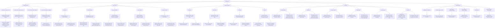

# Intake Call PQ Response Map

This diagram maps quiz (PQ) answers to the specific voice phrasing used in `intake_call_prompt.txt`.

```mermaid
flowchart TD
  Start["PQ Answers"] --> F["feelings_alcohol"]
  Start --> G["goal_alcohol"]
  Start --> A["areas_to_improve"]
  Start --> M["motivation"]
  Start --> L["learning_topics"]

  %% feelings_alcohol -> about-you tone + opening
  F --> F1["i_recently_cut_down_or_quit"]
  F --> F2["i_plan_to_take_steps_very_soon"]
  F --> F3["i_am_curious_about_changing"]
  F --> F4["i_am_not_interested_in_changing"]

  F1 --> FA1["Normalized phrase: 'you've already started making changes'"]
  F2 --> FA2["Normalized phrase: 'you're getting ready to take action soon'"]
  F3 --> FA3["Normalized phrase: 'you're exploring and learning what might work'"]
  F4 --> FA4["Normalized phrase: 'you're not looking to force change right now'"]

  FA1 --> AB1["About-you ask: celebrate progress; ask what prompted recent change and what they want to protect"]
  FA2 --> AB2["About-you ask: action-oriented; ask what makes now feel like the right moment"]
  FA3 --> AB3["About-you ask: gentle exploration; ask what they noticed and what they are wondering about"]
  FA4 --> AB4["About-you ask: no-pressure; ask what made them open Pelago today"]

  %% goal_alcohol -> normalized + follow-up anchors + outcomes question template
  G --> G1["drink_less"]
  G --> G2["quit_eventually"]
  G --> G3["track_consumption"]
  G --> G4["learn_explore"]
  G --> G5["maintain_sobriety"]

  G1 --> GN1["Normalized phrase: 'cut back on drinking'"]
  G2 --> GN2["Normalized phrase: 'work toward quitting over time'"]
  G3 --> GN3["Normalized phrase: 'understand your patterns and track consumption'"]
  G4 --> GN4["Normalized phrase: 'explore options before deciding on a change'"]
  G5 --> GN5["Normalized phrase: 'protect your sobriety'"]

  GN1 --> GF1["About-you follow-up: ask for a real-life moment when this feels hardest"]
  GN2 --> GF2["About-you follow-up: ask what a realistic first step toward quitting would look like"]
  GN3 --> GF3["About-you follow-up: ask what patterns they are most curious to notice"]
  GN4 --> GF4["About-you follow-up: ask what they hope to learn before deciding"]
  GN5 --> GF5["About-you follow-up: ask what support helps them stay steady"]

  GN1 --> O1["Outcomes prompt: 'what would cutting back look like in a good week?'"]
  GN2 --> O2["Outcomes prompt: 'what would progress toward quitting look like right now?'"]
  GN3 --> O3["Outcomes prompt: 'what patterns do you want to understand better?'"]
  GN4 --> O4["Outcomes prompt: 'what would help you feel clearer about next steps?'"]
  GN5 --> O5["Outcomes prompt: 'what outcomes help you protect sobriety this week?'"]

  %% areas_to_improve -> outcomes framing + weekly suggestion style
  A --> A1["frequency"]
  A --> A2["moderation"]
  A --> A3["intensity"]
  A --> A4["explore"]

  A1 --> AN1["Normalized phrase: 'drink on fewer days or specific times'"]
  A2 --> AN2["Normalized phrase: 'have fewer drinks on drinking days'"]
  A3 --> AN3["Normalized phrase: 'avoid heavy drinking situations'"]
  A4 --> AN4["Normalized phrase: 'observe and learn before committing to changes'"]

  AN1 --> AO1["Outcomes framing: specific alcohol-free days/times"]
  AN2 --> AO2["Outcomes framing: limits per occasion/day"]
  AN3 --> AO3["Outcomes framing: avoid heavy episodes"]
  AN4 --> AO4["Outcomes framing: awareness first, no forced commitment"]

  AN1 --> AW1["Weekly-focus suggestion: specific no-drink days/times"]
  AN2 --> AW2["Weekly-focus suggestion: realistic drink limit before known trigger"]
  AN3 --> AW3["Weekly-focus suggestion: plan around one high-risk situation"]
  AN4 --> AW4["Weekly-focus suggestion: observation-only focus (when/why/how)"]

  %% motivation -> motivation deep-dive + check-ins optional one-liner
  M --> M1["physical_health"]
  M --> M2["wellbeing"]
  M --> M3["personal_growth"]
  M --> M4["relationships"]
  M --> M5["saving_money"]
  M --> M6["incentive"]

  M1 --> MQ1["Motivation ask: what body/health change they most want to notice"]
  M2 --> MQ2["Motivation ask: what feeling better day-to-day would look like"]
  M3 --> MQ3["Motivation ask: what 'growth' means in their own words this month"]
  M4 --> MQ4["Motivation ask: which relationship they most want to improve"]
  M5 --> MQ5["Motivation ask: what financial win would feel meaningful"]
  M6 --> MQ6["Motivation ask: acknowledge incentives neutrally, then ask one personal reason beyond rewards"]

  M1 --> CR1["CM-rewards one-liner: 'Small daily check-ins make it easier to notice health and mood changes.'"]
  M2 --> CR2["CM-rewards one-liner: 'Small daily check-ins make it easier to notice health and mood changes.'"]
  M3 --> CR3["CM-rewards one-liner: 'These check-ins help you see progress over time.'"]
  M4 --> CR4["CM-rewards one-liner: 'They can help you stay aligned with what matters in your relationships.'"]
  M5 --> CR5["CM-rewards one-liner: 'They can also make spending patterns easier to spot.'"]
  M6 --> CR6["CM-rewards one-liner: 'And yes, rewards can be part of what keeps this consistent.'"]

  %% learning_topics -> weekly-focus suggestion hooks
  L --> L1["mindfulness / meditation"]
  L --> L2["cravings_support / habits"]
  L --> L3["sleep_quality / emotional_stability"]
  L --> L4["self_confidence / decision_making"]
  L --> L5["relationships"]
  L --> L6["financial_stability / diet_nutrition"]

  L1 --> LH1["Weekly hook: pause before first drink"]
  L2 --> LH2["Weekly hook: swap routine in known trigger window"]
  L3 --> LH3["Weekly hook: evening wind-down alternatives"]
  L4 --> LH4["Weekly hook: pre-commitment script before social events"]
  L5 --> LH5["Weekly hook: connection-focused intention"]
  L6 --> LH6["Weekly hook: spending/food-energy reflection intention"]
```
